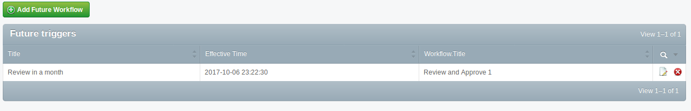

# SilverStripe Future Workflows

Allows the configuration of workflows (from the Advanced Workflow module) that will be started 
at some point in the future. 



## Composer Install

```
composer require symbiote-library/silverstripe-futureworkflow:~1.0
```

## Requirements

* SilverStripe 3.5+
* Advanced Workflow 3.8+

## Documentation

* [Quick Start](docs/en/quick-start.md)
* [Advanced Usage](docs/en/advanced-usage.md)
* [License](LICENSE.md)
* [Contributing](CONTRIBUTING.md)